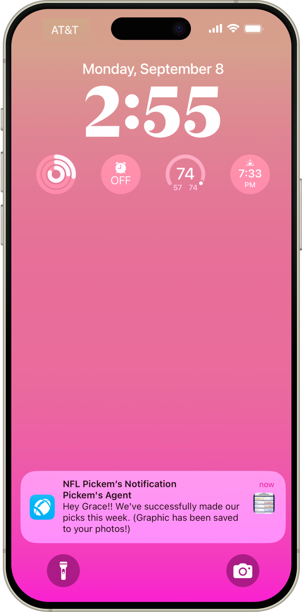
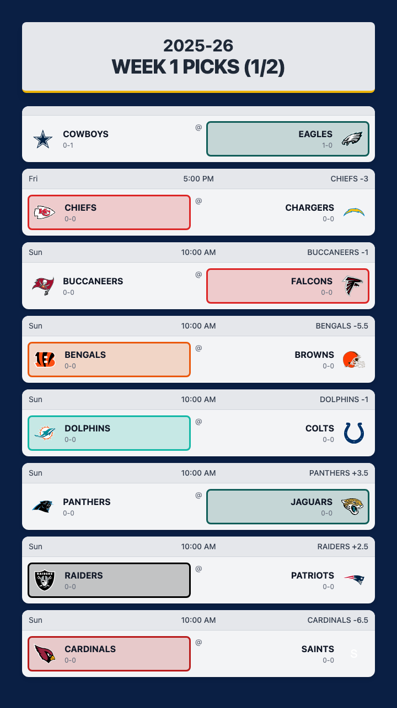
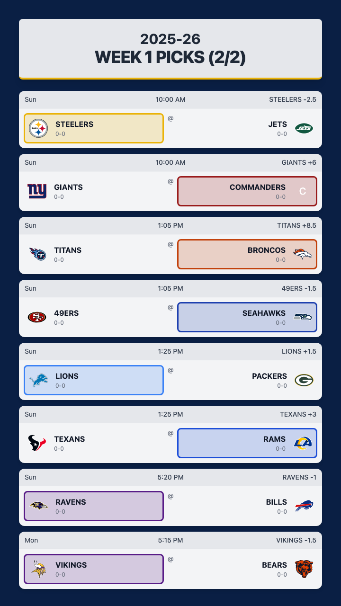

# CBS Pickem Automation
A complete automation solution for CBS Sports NFL Pickem pools that handles login, matchup extraction, pick generation, submission, and social preview creation.

<div align="center">
  <div style="display: flex; justify-content: space-between;">
    
    
    
  </div>
</div>


## Features

- **Automated Login**: Handles CBS Sports authentication with cookie storage
- **Matchup Extraction**: Reads and saves all weekly NFL matchups with detailed stats
- **Smart Predictions**: Generates picks based on expert consensus and team preferences
- **Automated Submission**: Submits picks to CBS Sports automatically
- **Social Previews**: Creates shareable graphics of your weekly picks
- **Scheduled Execution**: Runs automatically every Thursday morning
- **Native Notifications**: Provides macOS notifications for workflow status
- **GitHub Integration**: Commits and pushes generated files to your repository

## Table of Contents

- [Setup](#setup)
  - [Prerequisites](#prerequisites)
  - [Installation](#installation)
  - [Environment Variables](#environment-variables)
- [Usage](#usage)
  - [Initial Authentication](#initial-authentication)
  - [Manual Execution](#manual-execution)
  - [Scheduled Execution](#scheduled-execution)
  - [iOS Integration](#ios-integration)
- [Authentication Notes](#authentication-notes)
  - [Session Management](#session-management)
  - [Reauthentication](#reauthentication)
- [Troubleshooting](#troubleshooting)
- [Scripts Overview](#scripts-overview)

## Setup

### Prerequisites

- Python 3.8 or higher
- macOS (for native notifications and launchd scheduling)
- Git (for repository operations)
- CBS Sports account with access to a Pickem pool

### Installation

1. **Clone the repository**

   ```bash
   git clone https://github.com/yourusername/cbs-pickem-automation.git
   cd cbs-pickem-automation
   ```

2. **Create and activate a virtual environment**

   ```bash
   python -m venv venv
   source venv/bin/activate  # On Windows: venv\Scripts\activate
   ```

3. **Install dependencies**

   ```bash
   pip install -r requirements.txt
   ```

4. **Install Playwright browsers**

   ```bash
   playwright install
   ```

### Environment Variables

Create a `.env` file in the project root with the following variables:

```
CBS_USERNAME=your_email@example.com
CBS_PASSWORD=your_password
CBS_POOL_URL=your_pool_url
```

- `CBS_USERNAME`: Your CBS Sports account email
- `CBS_PASSWORD`: Your CBS Sports account password
- `CBS_POOL_URL`: The URL of your CBS Sports Pickem pool

## Usage

### Initial Authentication

1. **Run the login script**

   ```bash
   python login.py
   ```

   This will open a browser window where you can log in to CBS Sports. Complete any CAPTCHA or verification steps if required.

2. **Verify authentication**

   ```bash
   python check_session.py
   ```

   This will confirm if your login was successful and cookies were saved correctly.

### Manual Execution

Run the complete workflow manually:

```bash
phython run_local_workflow.py
```

This will:
1. Check if your authentication is valid
2. Extract this week's matchups
3. Generate predictions
4. Submit picks to CBS
5. Create social preview images
6. Commit and push changes to GitHub

### Scheduled Execution

The workflow is designed to run automatically every Thursday at 8:30 AM using macOS launchd.

1. **Copy the launchd plist file**

   ```bash
   cp com.user.cbspickem.plist ~/Library/LaunchAgents/
   ```

2. **Edit the plist file to match your paths**

   ```bash
   nano ~/Library/LaunchAgents/com.user.cbspickem.plist
   ```

   Update the paths to match your repository location.

3. **Load the launchd job**

   ```bash
   launchctl load ~/Library/LaunchAgents/com.user.cbspickem.plist
   ```

4. **Verify the job is loaded**

   ```bash
   launchctl list | grep cbspickem
   ```

### iOS Integration

You can receive iOS notifications and save social preview images directly to your Photos app using iOS Shortcuts.

1. **Install the iOS Shortcut**

   - Transfer the `iphone-shortcut/NFL Pickem's.shortcut` file to your iPhone
   - Open it to install the shortcut
   - Grant necessary permissions when prompted

2. **Configure the Shortcut**

   - Open the Shortcuts app
   - Edit the "NFL Pickem's" shortcut
   - Update the GitHub repository URL if needed
   - Ensure the "Save to Photos" action is enabled if you want images saved to your Photos app

3. **Schedule the Shortcut**

   - Open the Shortcuts app
   - Tap on the "Automation" tab at the bottom
   - Tap the "+" button and select "Create Personal Automation"
   - Select "Time of Day" and set it to 9:00 AM (or your preferred time)
   - Select the days you want it to run (e.g., Thursdays)
   - Tap "Next" and add an action to run your "NFL Pickem's" shortcut
   - Disable "Ask Before Running" for true automation
   - Tap "Done"

4. **What the Shortcut Does**

   - Checks your GitHub repository for new social preview images
   - Downloads the latest images
   - Saves them to your Photos app
   - Sends you an iOS notification with the preview
   - Allows you to share your picks directly from the notification

## Authentication Notes

### Session Management

CBS Sports uses cookies for authentication, which typically expire after 1-2 weeks.

- **Cookie Storage**: When you log in successfully, your session is saved to `cbs_storage.json`
- **Automatic Reuse**: All scripts automatically use this file if it exists and is valid
- **Security**: The `cbs_storage.json` file is included in `.gitignore` to prevent accidental commits

### Reauthentication

When your CBS Sports authentication expires:

1. You'll receive a macOS notification indicating authentication failure
2. To reauthenticate, simply run:
   ```bash
   python login.py
   ```
3. Complete the authentication process in the browser window
4. Verify success with:
   ```bash
   python check_session.py
   ```

#### Authentication Limitations

The CBS Sports login process includes security measures that may require manual intervention:

- **CAPTCHA/Verification**: The login process may include CAPTCHA challenges or other verification steps
- **Manual Steps**: If automatic login fails, you'll need to complete verification steps manually
- **Session Duration**: CBS Sports sessions typically last 1-2 weeks before requiring reauthentication

## Troubleshooting

### Common Issues

1. **Authentication Failures**
   - Run `python login.py` to create a new session
   - Check that your credentials in `.env` are correct

2. **Script Errors**
   - Check `cbs_pickem_workflow.log` for detailed error information
   - Ensure your Python environment is activated: `source venv/bin/activate`

3. **Scheduled Job Not Running**
   - Verify the job is loaded: `launchctl list | grep cbspickem`
   - Check system logs: `log show --predicate 'processImagePath contains "cbspickem"' --last 1h`

4. **CBS Website Changes**
   - If CBS changes their website structure, scripts may need updating
   - Check for updates to this repository or submit an issue

### Logs

The workflow creates detailed logs:
```bash
cat cbs_pickem_workflow.log
```

## Scripts Overview

- **login.py**: Handles authentication with CBS Sports and saves session cookies
- **check_session.py**: Verifies if your saved authentication is valid
- **read_matchups.py**: Extracts weekly matchups and saves to JSON
- **predict_winners.py**: Generates predictions based on expert consensus
- **make_picks.py**: Submits your picks to CBS Sports
- **generate_social_previews.py**: Creates shareable graphics of your picks
- **run_local_workflow.py**: Orchestrates the entire workflow

## License

MIT
